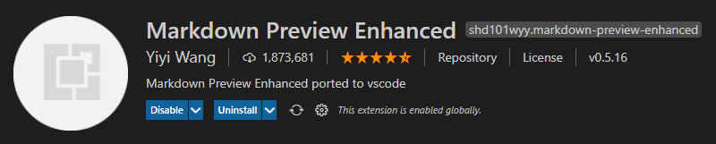

# menguasai-markdown

Markdown adalah sintaks yang ringan dan mudah digunakan untuk mengatur gaya semua bentuk tulisan di platform GitHub.

#

Sebelum memulai, saya menyarankan untuk anda jika saat ini menggunakan Visual Studio Code sebagai Text Editor maka Ekstensi ini wajib kalian download agar memudahkan untuk melihat hasil perubahan yang dibuat, berikut ekstensi nya :

#

#

- [Link Repository](https://github.com/shd101wyy/vscode-markdown-preview-enhanced)
- [Markdown Preview Enhanced Download](https://marketplace.visualstudio.com/items?itemName=shd101wyy.markdown-preview-enhanced)

## Apa itu Markdown ?

Markdown adalah cara untuk mengatur gaya teks di web. Anda dapat memberikan keterangan dengan tampilan yang lebih menarik, seperti memberikan kata menjadi tebal atau miring, menambahkan gambar. Cara seperti ini agar membuat tampilan lebih mudah di mengerti oleh si pembaca.

Anda dapat menggunakan Markdown di beberapa tempat seperti GitHub. File ekstensi Markdown adalah .md atau .markdown

# Headers

`#` ini adalah sama seperti tag `<h1>`  

# ini contoh `#`  

`##` ini adalah sama seperti tag `<h2>`  

## ini contoh `##`  

`###` ini adalah sama seperti tag `<h3>`  

### ini contoh `###`  

`####` ini adalah sama seperti tag `<h4>`  

#### ini contoh `####`  

`#####` ini adalah sama seperti tag `<h5>`  

##### ini contoh `#####`  

`######` ini adalah sama seperti tag `<h6>`  

###### ini contoh `######`
